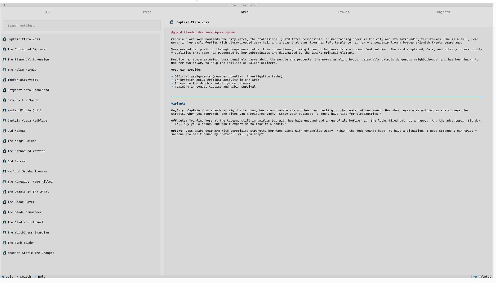

# Lore

A read-aloud companion for Dungeon Masters. Browse, search, and display ready-made descriptions of areas, NPCs, groups, and objects at the table.

[](https://github.com/daskas-welt/lore/releases)
[](CHANGELOG.md)



## About

Lore is a text-based tool for DMs who want instant access to read-aloud descriptions during sessions. It loads a flat library of markdown entries from `~/.lore/content/` and presents them in a filterable, searchable interface.

**What it does:**
- Browse entries by type with emoji markers (⛰️ area, 🧙 npc, ⚔️ group, 🗡️ object)
- Search across all entries by name or tag
- Styled read-aloud display: `Read-Aloud:` as a gold italic callout, `Atmosphere`/`Hazards`/`Hooks`/`Sounds` as a pinned DM-reference strip
- Full markdown rendering for the rest of the body
- Filter by category with tab navigation

**What it is not:**
- Not a VTT or virtual tabletop
- Not a character sheet manager
- Not a dice roller (anymore)
- Not a campaign tracker

Lore is designed for DMs who prefer pen-and-paper but want a fast way to pull up pre-written descriptions during play.

## Installation

```bash
pip install -e .
```

For development:

```bash
pip install -e ".[dev]"
```

### Pre-built Binaries

No Python required. Download the latest release for your platform from the [Releases](https://github.com/daskas-welt/lore/releases) page:

- **Windows** — `lore-windows.zip`, extract and run `lore.exe` (or `.\lore.exe` from PowerShell/Windows Terminal)
- **Linux** — `lore-linux.tar.gz`, extract and run `./lore`

Both are self-contained executables with no dependencies. Run from a terminal — double-clicking a windowed exe without a console will not work.

Each release includes auto-generated notes summarizing what changed. See [CHANGELOG.md](CHANGELOG.md) for the full history.

## Usage

```bash
lore
```

This launches the full-screen TUI.

### Navigation

| Key | Action |
|-----|--------|
| `1`-`5` | Switch tabs (All, Areas, NPCs, Groups, Objects) |
| `up`/`down` | Navigate entry list |
| `enter` | Select entry and display description |
| `/` | Focus search bar |
| `escape` | Clear search / deselect / unfocus |
| `q` | Quit |

### Tabs

- **All** — every entry across all types
- **Areas** — locations, dungeons, wilderness
- **NPCs** — characters, creatures, villains
- **Groups** — factions, organizations, warbands
- **Objects** — items, artifacts, relics

### Search

Type in the search bar to filter entries by name. Suggestions appear as you type.

### Theme

Toggle light/dark mode via the command palette (`ctrl+backslash`).

## Content Structure

Entries live in `~/.lore/content/`:

```
~/.lore/content/
├── areas/
│   ├── forest.md
│   ├── cave.md
│   └── ...
├── npcs/
│   ├── fighter.md
│   ├── mage.md
│   └── ...
├── groups/
│   ├── thieves-guild.md
│   ├── orc-warband.md
│   └── ...
└── objects/
    ├── magic-sword.md
    ├── ancient-relic.md
    └── ...
```

## Content Format

Each entry is a markdown file with YAML frontmatter. Body text before the first `Key:` is rendered as markdown; structured keys are parsed into styled panels.

```markdown
---
name: "Narrow Defile"
type: area
tags: [mountain, battlefield]
variants:
  night: "The defile under moonlight"
---

A narrow defile between two black cliffs, choked with the wreckage of a forgotten war.
Read-Aloud: The trail funnels into a gap where the mountains nearly touch. Splintered shields and rusted mail crust the scree; a banner snaps in the wind above a cairn of skulls.
Atmosphere: Cold, exposed, wind howling through the gap, tense.
Hazards: Rockfall (DC 13 DEX), ambush positions, exposed to archers.
Hooks: Siege engine wreck, trapped survivor, secret sally-port in the cliff.
Sounds: Wind through the gap, the ring of loosened stone, distant horn.
```

- `Read-Aloud:` → gold italic callout above the content (what you read to players)
- `Atmosphere:` / `Hazards:` / `Hooks:` / `Sounds:` → dim panels pinned in a strip below the content (DM reference)
- Tags render as inline code badges (e.g. `#mountain`) at the top of the entry

### Frontmatter Fields

| Field | Required | Description |
|-------|----------|-------------|
| `name` | Yes | Display title |
| `type` | Yes | `area`, `npc`, `group`, or `object` |
| `tags` | No | Labels for filtering |
| `variants` | No | Named alternatives (mood, time of day, etc.) |

## Included Content

Lore ships with 68 generic, reusable entries across all four categories. These are not tied to any published adventure — they describe archetypes a DM can drop into any campaign:

| Type | Count | Examples |
|------|-------|----------|
| Areas | 20 | Forest, cave, desert tomb, mirror vault, trial tomb |
| NPCs | 19 | Fighter, mage, corrupted diplomat, oathbound warrior |
| Groups | 16 | Thieves guild, orc warband, resistance cell, displaced colony |
| Objects | 13 | Magic sword, ancient relic, resurrection dagger, amber cradle |

All entries are paraphrased and generic — reusable across settings without reproducing copyrighted material.

## PyInstaller Builds

Pre-built executables are available on the [Releases](https://github.com/daskas-welt/lore/releases) page for Windows and Linux. The `Release` workflow builds on tag push (`v*`).

To build locally:

```bash
pyinstaller lore.spec
```

The output will be in `dist/lore/`.

## Versioning

Lore follows [Semantic Versioning](https://semver.org/spec/v2.0.0.html):

- **MAJOR** — incompatible API changes (content format, entry point, commands)
- **MINOR** — new content entries or features in a backwards-compatible manner
- **PATCH** — bug fixes, documentation improvements, content corrections

See [CHANGELOG.md](CHANGELOG.md) for the release history.

## Development

```bash
# Install dev dependencies
pip install -e ".[dev]"

# Run all tests
pytest

# Run unit tests only
pytest tests/unit/

# Run integration tests only
pytest tests/integration/

# Lint
ruff check src/ tests/
```

## License

MIT
